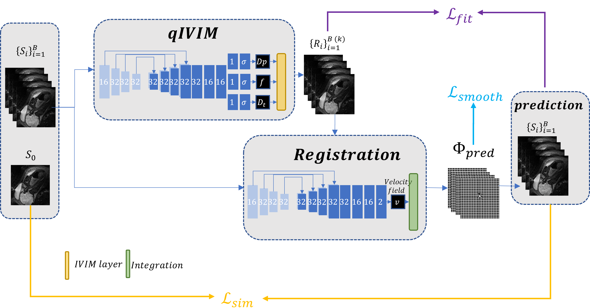

## IVIM-Morph

IVIM-Morph is a self-supervised deep neural network model for motion-corrected quantitative analysis of DWI data using the Intra-voxel Incoherent Motion (IVIM) model.



## Installation

To use this project, follow these steps:

1. **Clone the Repository:**
   ```sh
   git clone https://github.com/TechnionComputationalMRILab/qDWI-Morph.git
2. **Install Dependecie (via conda)**
   ```sh
   conda env create -f IVIM_Morph/environment.yml

## Contact

Please contact us on noga.kertes@campus.technion.ac.il


